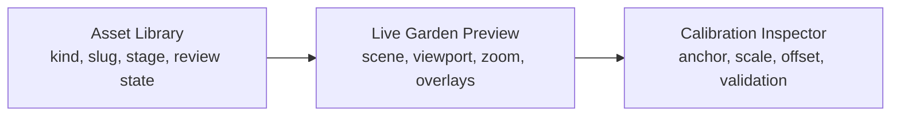
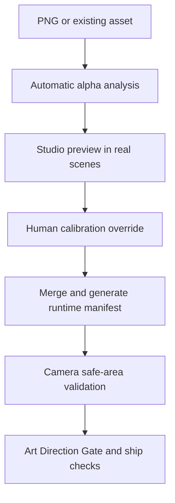

# Asset Calibration Studio + Camera Safe Area — MVP Spec

**Status:** Implemented — footprint-aware v2
**Date:** 2026-07-15  
**Direction:** B — calibration metadata and camera safety before pixel editing

## 1. Outcome

**Asset Calibration Studio** is a development-only workspace for previewing plants and decorations in the real garden renderer, adjusting their display metadata, and validating them across supported scenes and viewports.

**Camera Safe Area** is a scene-fitting rule that includes transformed sprite silhouettes, the ground plane, HUD insets, and breathing room when calculating the idle camera.

Choose both because the studio solves **Asset Calibration**, while the safe-area calculation solves **Viewport Clipping**. Per-asset offsets alone cannot reliably solve clipping without breaking ground contact on another viewport.

## 2. Problem statement

The repository already analyzes PNG alpha bounds and generates `anchorX`, `anchorY`, and `scale`. Runtime plant and decoration renderers consume that manifest. The remaining gaps are:

1. There is no visual interface for reviewing or overriding generated metadata.
2. Asset review does not systematically cover garden backgrounds, neighboring objects, edge positions, zoom levels, and mobile viewports.
3. The idle camera fits the garden surface but does not use the union of all visible sprite silhouettes, so tall or asymmetric art can approach or cross the viewport edge.
4. Manual corrections currently risk becoming component-level magic numbers.

## 3. MVP scope

### In scope

- Development-only route at `/dev/asset-studio`.
- Existing manifest-backed plant stages and decorations.
- Import a local PNG for temporary preview and analysis.
- Edit `anchorX`, `anchorY`, `scale`, `offsetX`, and `offsetY`.
- Store reviewed display profiles per footprint and edit canonical decoration footprint through a code-first catalog migration.
- Preview through the production plant/decoration rendering path.
- Five scene presets and three viewport presets.
- Overlays for alpha bounds, anchor, tile footprint, shadow center, and safe frame.
- Persist reviewed values to a source-controlled override file.
- Merge automatic analysis with reviewed overrides when regenerating the runtime manifest.
- Pure camera-safe-area calculation shared by the studio and garden.

### Out of scope

- Background removal, inpainting, recoloring, relighting, or other pixel editing.
- Uploading assets to Supabase or writing directly to a linked database.
- Production-user access to the studio.
- Replacing the current asset generation pipeline or Art Direction Gate.
- Automatic artistic approval; style and projection remain human-reviewed.

## 4. Screen layout



| Zone | Main controls | Purpose |
|---|---|---|
| Asset Library | Search, Plant/Decoration tabs, stage strip, import PNG | Select the item under review |
| Preview toolbar | Scene, viewport, zoom, placed/ghost mode, overlay toggles | Reproduce meaningful runtime contexts |
| Live preview | Real garden renderer, draggable anchor handle, safe frame | Make calibration visible and direct |
| Inspector | Numeric inputs, sliders, auto values, reset, warnings, save | Produce a deliberate, auditable override |

The inspector shows the base value beside each effective footprint draft and reports the number of changed profile fields. Reset profile removes only the selected footprint; reset all is a separate confirmed action.

## 5. Bench and sandbox

**Calibration Bench** tightly frames the complete `N×N` footprint on a neutral checker/ground surface. The anchor cell, alpha bounds, contact point and production shadow remain inspectable; editor magnification `Fit/100/150/250%` scales the whole logical scene and is never saved.

**Production Sandbox** is a collapsed final-check surface using the real sanctuary background and ground canvas. Reviewers can click a tile or choose Center, Edge and Corner, show neighbor references, and switch between `390×844`, `768×1024`, and `1440×900` logical viewports. The full viewport is rendered at production pixels before an outer fit transform is applied.

## 6. Calibration model

**Sprite Anchor Point** identifies the source-canvas point that touches the garden surface. It is normalized to the source image, not measured in runtime pixels.

**Tile-relative Offset** is an intentional visual nudge after grounding. It is stored in tile units so it remains stable across device pixel ratio and camera zoom:

- `offsetX > 0`: move right by `offsetX × tileSize`.
- `offsetY > 0`: move down by `offsetY × tileSize`.
- Default: `0` for both axes.
- Soft warning: absolute value above `0.25` usually indicates a bad anchor or source canvas.

The effective display contract becomes:

```ts
interface GameAssetDisplaySpec {
  anchorX: number // 0..1, source canvas
  anchorY: number // 0..1, source canvas
  scale: number   // asset calibration only; footprint scaling remains separate
  offsetX: number // tile-relative projected X
  offsetY: number // tile-relative projected Y
}

type FootprintKey = `${number}`

interface GameAssetEntry {
  display: GameAssetDisplaySpec
  displayByFootprint?: Record<FootprintKey, GameAssetDisplaySpec>
  canonicalFootprint?: number
}
```

Recommended editor ranges:

| Field | Range | Step |
|---|---:|---:|
| `anchorX`, `anchorY` | `0..1` | `0.001` |
| `scale` | `0.5..1.5` | `0.01` |
| `offsetX`, `offsetY` | `-0.5..0.5` | `0.01` |

Anchor dragging changes only `anchorX/Y`. Moving the object relative to its correctly grounded tile changes only `offsetX/Y`; the UI must not silently convert one operation into the other.

## 7. Override data contract

Automatic analysis remains generated. Human review is stored separately at `config/game-asset-overrides.json` schema v2. Existing v1 entries migrate losslessly to `base`; new exact profiles live under `profiles[N]` and fall back to base when absent.

```json
{
  "schemaVersion": 2,
  "assets": {
    "plant:cactus:05-mature": {
      "profiles": {
        "2": {
          "display": {
            "scale": 0.94,
            "offsetX": 0.02
          },
          "reason": "Balance the mature silhouette in its 2×2 footprint."
        }
      }
    }
  }
}
```

Rules:

- Keys use the existing stable manifest asset ID, including plant stage; footprint profiles use positive integer string keys.
- `display` is partial; omitted fields keep analyzer values.
- `reason` is required for a saved manual override.
- The generated manifest is never edited directly.
- The analyzer deep-merges `auto display → base override → exact footprint profile → defaults`.
- Removing one profile restores base/automatic behavior for that footprint; reset all removes the whole asset override.

## 8. Save and review flow



For a new imported PNG, the MVP may preview from an object URL. Saving first requires placing the file at its canonical asset path; the studio must not invent a production path or write outside approved asset directories.

## 9. Camera Safe Area

The idle camera must fit **Visual Scene Bounds**, defined as the union of:

- projected ground-plane bounds;
- every visible asset's transformed alpha bounds;
- contact/cast shadows when they extend beyond the sprite bounds;
- top, bottom, left, and right UI safe insets;
- a configurable breathing margin.

For each asset:

1. Read normalized `analysis.bounds` and effective display metadata.
2. Translate bounds so `anchorX/Y` maps to the entity's tile contact point.
3. Apply asset scale and tile-relative offset.
4. Apply footprint/grid-size scale separately.
5. Project the four bound corners into garden-local coordinates.
6. Union the result with the scene bounds.

The available viewport rectangle is:

```text
left   = viewport left + horizontal margin
right  = viewport right - horizontal margin
top    = viewport top + top HUD inset + breathing margin
bottom = viewport bottom - bottom dock inset - breathing margin
```

The base fit is `min(1, availableWidth / boundsWidth, availableHeight / boundsHeight)` with no `0.5` floor. Idle pan centers the visual bounds inside the available rectangle. User zoom remains an independent multiplier; direct pan/zoom may intentionally move the scene outside the safe frame. Reset returns user zoom to `1` and pan to `0`, while initial fit and resize recompute the base fit.

The safe-area function must be pure and deterministic so it can be unit-tested without rendering the DOM.

## 10. Guardrails

- Route returns `notFound()` outside development unless a future explicit admin gate is designed.
- Saving uses a development-only server boundary and never connects to Supabase. Canonical decoration footprint changes create a migration file for later application.
- Placed and placement-ghost previews consume the same effective display spec.
- Camera safety cannot mutate asset metadata.
- Asset offset cannot mutate grid occupancy or collision geometry.
- Analyzer warnings remain visible; a manual override does not automatically mark an asset art-approved.
- Existing `anchorX/Y/scale` values remain backward compatible through default `offsetX/Y = 0`.

## 11. Proposed implementation map

| Area | Proposed location |
|---|---|
| Studio route | `src/app/dev/asset-studio/page.tsx` |
| Studio UI | `src/components/dev/asset-studio/` |
| Override schema and merge | `src/lib/assets/asset-calibration.ts` |
| Reviewed overrides | `config/game-asset-overrides.json` |
| Analyzer merge | `scripts/analyze-game-assets.mjs` |
| Safe-area math | `src/lib/garden/camera-safe-area.ts` |
| Garden integration | `src/components/garden/isometric-garden.tsx` |
| Unit/component tests | adjacent `__tests__` directories |

## 12. Acceptance criteria

- All manifest-backed plants/stages and decorations are selectable in the studio.
- A reviewer can see analyzer and effective metadata, adjust five fields, reset, and save with a reason.
- Running `npm run assets:analyze` preserves reviewed overrides and emits both offsets in the runtime manifest.
- The same effective transform is visible in normal placement and ghost placement.
- Edge Stress reports no unintended clipping at `390×844`, `768×1024`, and `1440×900` for default camera fit.
- Reset camera and viewport resize recompute fit from Visual Scene Bounds.
- Manual pan/zoom does not fight the safe-area fitter after direct manipulation begins.
- Unit tests cover override merging, bounds transformation, fit calculation, defaults, and invalid metadata.
- `npm run assets:check`, relevant Vitest suites, lint, and build are run before shipping; unresolved source-art failures remain visible and documented.

## 13. Delivery slices

1. **Metadata Foundation** — override schema, analyzer merge, effective runtime contract, pure transform helpers.
2. **Calibration Studio** — library, preview, inspector, presets, saving, review warnings.
3. **Camera Safety** — visual scene bounds, idle/reset/responsive fit integration, edge tests.
4. **Runtime QA** — ghost parity, current assets review, mobile/desktop regression pass, documentation update.

Pixel editing remains a later workflow only if calibration shows that metadata cannot repair the source artwork.

## 14. Implementation notes

- Shared analyzer: `src/lib/assets/server/game-asset-pipeline.mjs`.
- Runtime transform helpers: `src/lib/assets/game-asset-display.ts` and `game-asset-render-metrics.ts`.
- Development API: `/api/dev/asset-studio/analyze` and `/api/dev/asset-studio/overrides`; both return 404 outside development.
- Atomic mutation prepares validated override/full/runtime outputs before replacing destinations.
- Current source-art gate: 11 legacy opaque-background PNGs remain errors; 172 assets are still analyzed and emitted for review.
