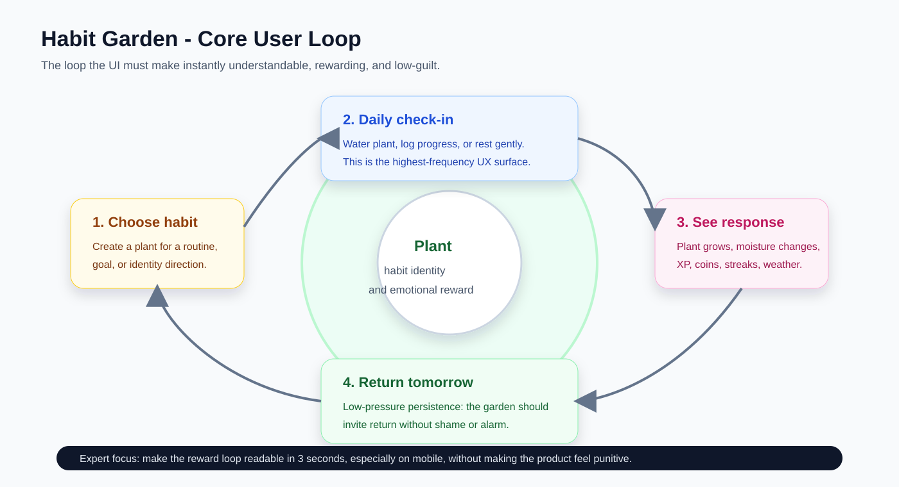
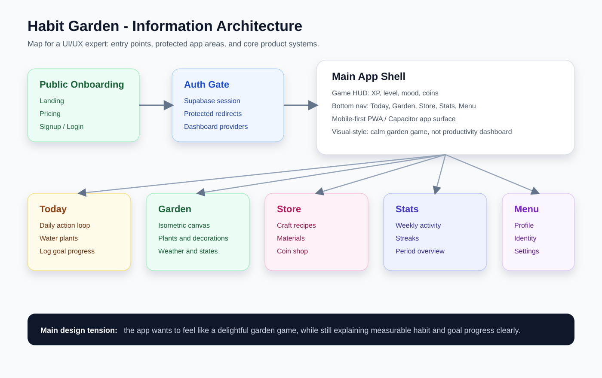

# Habit Garden - Brief cho chuyên gia hình ảnh, UI và UX

## 1. Tóm tắt sản phẩm

**Habit Garden** là một app xây dựng thói quen theo mô hình game: mỗi thói quen là một cây, mỗi lần check-in là tưới nước, cây lớn lên theo sự đều đặn của người dùng. App hướng đến cảm giác nhẹ nhàng, ít tội lỗi, có phần thưởng thị giác, thay vì cảm giác quản lý task hoặc dashboard năng suất.

**Core Loop** là vòng lặp hành vi chính: chọn thói quen -> check-in hằng ngày -> thấy cây phản hồi -> quay lại ngày mai. Chọn cải thiện core loop vì nó giải quyết **Retention Clarity**, trong khi chỉ làm đẹp từng màn hình riêng lẻ chủ yếu giải quyết **Visual Polish**.

## 2. App hiện gồm những phần nào

### Public onboarding

- Landing page: giải thích ý tưởng “grow your habits”.
- Pricing section: free/pro/forest tiers.
- Signup/login: tạo tài khoản hoặc đăng nhập.
- Protected redirect: vào `/garden` khi chưa login sẽ bị đưa về login.

### App sau đăng nhập

- Today (`/garden`): daily action surface, tưới cây/log progress.
- Garden (`/overview`): xem khu vườn và trạng thái theo khoảng thời gian.
- Store (`/store`): craft, materials, shop, coins.
- Stats (`/stats`): weekly activity, XP, streaks.
- Menu: profile, identity, workshop, shop, settings, sign out.

### Hệ thống sản phẩm phía sau UI

- Plants: cây đại diện cho habit identity.
- Moisture: độ ẩm giảm nếu không chăm cây.
- Growth stages: seed, sprout, growing, blooming, mature.
- XP/levels: phần thưởng tiến trình.
- Coins/materials/crafting: kinh tế nhẹ trong game.
- Goals: mục tiêu định lượng gắn với cây.
- Identity: người dùng định nghĩa con người mình muốn trở thành.
- Subscription: giới hạn free/pro/forest.

## 3. Tính cách thiết kế mong muốn

**Calm Game UI** là hướng thiết kế kết hợp sự vui của game với cảm giác nhẹ nhàng, không gây áp lực. Chọn Calm Game UI vì nó giải quyết **Low-Guilt Motivation**, trong khi productivity dashboard chỉ giải quyết **Task Tracking**.

Các nguyên tắc đã có trong project:

- Thiên nhiên, mềm, ấm, có chiều sâu.
- Không dùng cảnh báo đỏ/punitive nếu người dùng lỡ ngày.
- Garden là phần thưởng thị giác chính.
- UI game/HUD được phép vui, nhưng không được làm rối daily action.
- Mobile-first vì app có Capacitor/iOS/Android wrapper.

## 4. Điều chuyên gia cần hiểu trước khi góp ý

**Conceptual Model** của app là: cây không chỉ là progress bar. Cây là biểu tượng của một thói quen hoặc identity sống lâu dài.

Điểm đang dễ gây nhầm:

- Plant growth = sự đều đặn.
- Goal progress = con số đo được trong một giai đoạn.
- XP/coins/materials = phần thưởng phụ.
- Moisture/streak = trạng thái chăm sóc.

Chọn làm rõ Conceptual Model vì nó giải quyết **Progress Ambiguity**, trong khi chỉ đổi màu/icon chỉ giải quyết **Visual Comprehension** ở mức nông.

## 5. Các vấn đề UX đã quan sát

### P0 - User mới chưa thấy giá trị thật trước signup

**Value Preview Gap** là khoảng trống giữa lời hứa trên landing và bằng chứng sản phẩm thật. Landing nói về garden, plants, streaks, rewards, nhưng chưa show đủ app state để người dùng tin rằng sản phẩm thú vị.

Ảnh liên quan:

- [01-landing-desktop.png](./images/01-landing-desktop.png)
- [05-landing-mobile.png](./images/05-landing-mobile.png)
- [00-contact-sheet-all-screens.png](./images/00-contact-sheet-all-screens.png)

### P0 - Mobile first viewport chưa ưu tiên CTA

**Mobile Above-the-Fold Priority** là việc màn hình đầu tiên trên mobile phải trả lời nhanh: đây là gì, có đáng thử không, bấm ở đâu. CTA chính hiện dễ nằm dưới fold.

Ảnh liên quan:

- [05-landing-mobile.png](./images/05-landing-mobile.png)

### P0 - Auth redirect thiếu ngữ cảnh

**Contextual Redirect Messaging** là thông báo giải thích vì sao người dùng bị đưa sang login và họ sẽ quay lại đâu sau khi đăng nhập. Hiện `/garden` redirect về login khá trơn, dễ tạo cảm giác bị chặn cửa.

Ảnh liên quan:

- [04-login-redirect-from-garden.png](./images/04-login-redirect-from-garden.png)

### P0 - Goal progress và plant growth chưa tách nghĩa rõ

**Progress Ambiguity** là khi một màn hình có nhiều loại tiến trình nhưng không có hierarchy rõ. Trong app có plant growth, period goal, overall goal, moisture, streak, XP cùng xuất hiện.

Ảnh liên quan:

- [01-goal-plant-card.png](./images/01-goal-plant-card.png)
- [02-log-progress-choice.png](./images/02-log-progress-choice.png)
- [03-log-progress-form.png](./images/03-log-progress-form.png)

### P1 - Signup còn giống form SaaS hơn điểm bắt đầu của game

**Onboarding Framing** là cách biến signup thành bước đầu tiên của trải nghiệm, không chỉ là form tài khoản. Signup có thể mang cảm giác “plant your first seed” thay vì “create account”.

Ảnh liên quan:

- [03-signup.png](./images/03-signup.png)
- [06-signup-mobile.png](./images/06-signup-mobile.png)

### P1 - Goal wizard bắt người dùng học thuật ngữ hệ thống

**User-Language Mapping** là việc UI nói theo ý định của người dùng, không theo model nội bộ. Các lựa chọn như Build Capacity, Total Progress, Growth Pattern cần được dịch thành ngôn ngữ tự nhiên hơn.

Ảnh liên quan:

- [04-goal-wizard-type.png](./images/04-goal-wizard-type.png)
- [05-goal-wizard-frequency.png](./images/05-goal-wizard-frequency.png)
- [06-goal-wizard-target.png](./images/06-goal-wizard-target.png)
- [07-goal-wizard-review.png](./images/07-goal-wizard-review.png)

## 6. Câu hỏi tư vấn trọng tâm

1. Landing nên show sản phẩm thật như thế nào để người dùng hiểu ngay “habit thành garden”?
2. Mobile hero nên rút gọn ra sao để CTA và product preview cùng xuất hiện trong viewport đầu?
3. Signup nên chuyển thành trải nghiệm “plant first seed” như thế nào mà vẫn đơn giản?
4. Dashboard navigation nên gọi Today/Garden/Stats/Store theo thứ tự nào để người dùng không nhầm entry point chính?
5. Garden nên ưu tiên cảm xúc hay thông tin đến mức nào?
6. Plant card nên hiển thị một progress chính nào: hôm nay, tuần này, cây lớn, hay goal?
7. Goal setup nên dùng ngôn ngữ tự nhiên nào thay cho thuật ngữ hệ thống?
8. Store/crafting có đang xuất hiện quá sớm so với core habit loop không?
9. Visual style hiện tại nên đi theo pixel/isometric game, soft illustration, hay hybrid?
10. Cần design system/token nào để app thống nhất giữa landing, auth và dashboard?

## 7. Output mong muốn từ chuyên gia

**Design Direction**: một hướng hình ảnh rõ ràng cho toàn app, gồm mood, palette, typography, icon/art style và spacing.

**UX Restructure**: đề xuất lại hierarchy của onboarding, daily loop, garden, goal progress.

**Screen-Level Recommendations**: góp ý cụ thể cho landing, signup, Today, Garden, plant card, log modal, goal wizard, Store, Stats.

**Priority Roadmap**: chia P0/P1/P2 để biết nên sửa gì trước.

**Reference Board**: 5-10 app/game/site tham chiếu phù hợp, kèm lý do chọn.

## 8. Phạm vi nên tránh trong buổi tư vấn đầu

- Chưa cần thiết kế lại database hoặc business logic.
- Chưa cần quyết định monetization cuối cùng.
- Chưa cần làm full high-fidelity từng màn hình.
- Không nên chỉ tranh luận palette; vấn đề chính là core loop, hierarchy và conceptual model.
