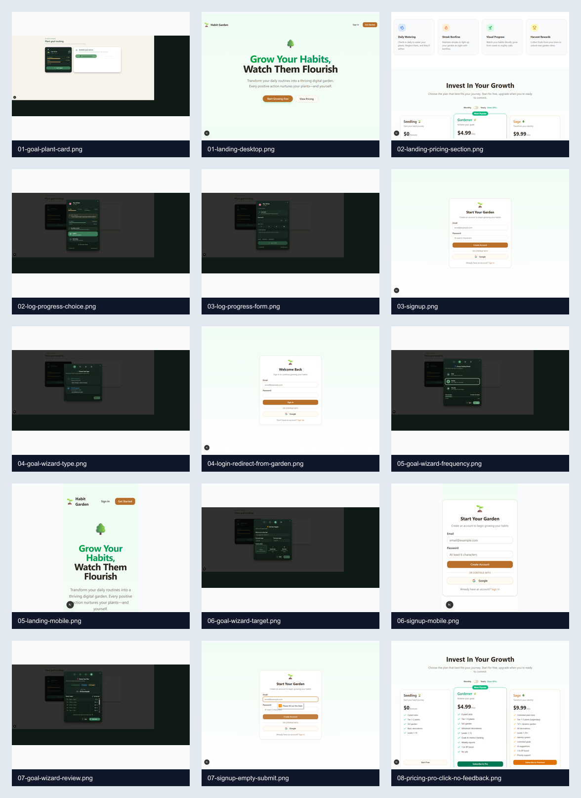

# Screen Inventory cho buổi review

Tài liệu này giúp chuyên gia đi từng màn hình và biết nên nhìn vấn đề gì.

## Ảnh tổng hợp

## Public onboarding

| Màn hình | Ảnh | Vai trò UX | Cần chuyên gia đánh giá |
|---|---|---|---|
| Landing desktop | [01-landing-desktop.png](./images/01-landing-desktop.png) | Giới thiệu concept và tạo động lực signup | Product preview, hero hierarchy, visual personality |
| Pricing section | [02-landing-pricing-section.png](./images/02-landing-pricing-section.png) | Giải thích free/pro/forest | Pricing copy theo outcome, feature meaning, trust |
| Signup desktop | [03-signup.png](./images/03-signup.png) | Tạo tài khoản | Có giống bước đầu của game không, có đủ reassurance không |
| Login redirect | [04-login-redirect-from-garden.png](./images/04-login-redirect-from-garden.png) | Auth gate khi user vào route protected | Message, return path, cảm giác bị chặn hay được hướng dẫn |
| Landing mobile | [05-landing-mobile.png](./images/05-landing-mobile.png) | First impression trên mobile | CTA above fold, type scale, product proof |
| Signup mobile | [06-signup-mobile.png](./images/06-signup-mobile.png) | Mobile account creation | Touch target, spacing, form framing |
| Empty submit | [07-signup-empty-submit.png](./images/07-signup-empty-submit.png) | Validation | Custom error/help text, accessibility |
| Pricing click issue | [08-pricing-pro-click-no-feedback.png](./images/08-pricing-pro-click-no-feedback.png) | Paid CTA | Feedback state, disabled/error handling |

## Goal progress flow

| Màn hình | Ảnh | Vai trò UX | Cần chuyên gia đánh giá |
|---|---|---|---|
| Goal plant card | [01-goal-plant-card.png](./images/01-goal-plant-card.png) | Trạng thái cây có goal | Progress hierarchy, one main question per card |
| Action choice | [02-log-progress-choice.png](./images/02-log-progress-choice.png) | Chọn hành động với cây | Có quá nhiều context trước hành động không |
| Log form | [03-log-progress-form.png](./images/03-log-progress-form.png) | Nhập tiến độ | Copy theo loại goal, quick input, feedback sau submit |
| Goal type | [04-goal-wizard-type.png](./images/04-goal-wizard-type.png) | Chọn loại mục tiêu | User-language mapping |
| Frequency | [05-goal-wizard-frequency.png](./images/05-goal-wizard-frequency.png) | Chọn chu kỳ | Cadence có tự nhiên không |
| Target | [06-goal-wizard-target.png](./images/06-goal-wizard-target.png) | Nhập chỉ tiêu | Có đang đưa decision nâng cao quá sớm không |
| Review | [07-goal-wizard-review.png](./images/07-goal-wizard-review.png) | Xác nhận plan | Nên summary hay bảng chi tiết |

## Màn hình chưa có screenshot đầy đủ trong package

Các màn hình này có trong app/codebase nhưng cần chụp thêm bằng tài khoản demo ổn định:

- Today live garden: `/garden`
- Garden period overview: `/overview`
- Store craft/shop: `/store`
- Stats: `/stats`
- Profile: `/profile`
- Identity: `/identity`
- Settings: `/settings`
- Plant detail sheet
- Add plant dialog
- Mood check-in
- Upgrade modal

## Gợi ý cho buổi chụp bổ sung

**State Coverage** là chụp nhiều trạng thái đại diện thay vì chỉ chụp happy path. Chọn State Coverage vì nó giải quyết **Design Blind Spots**, trong khi một screenshot đẹp chỉ giải quyết **Presentation Polish**.

Nên chụp thêm:

- Empty state: chưa có cây.
- First plant state: vừa tạo cây đầu tiên.
- Active state: 3-5 cây đang sống.
- Risk state: cây thiếu nước nhưng không tạo cảm giác tội lỗi.
- Mature state: cây trưởng thành, harvest/reward.
- Goal state: tuần này còn thiếu một phần target.
- Error/loading/disabled state.
- Mobile 390x844 và desktop 1440x900.
