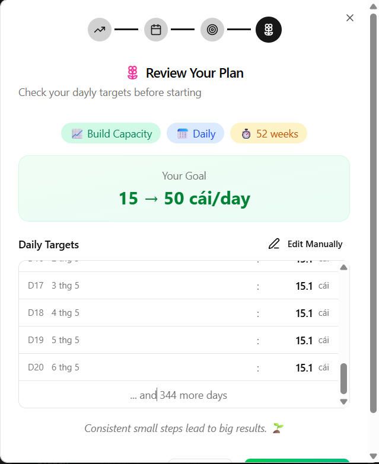
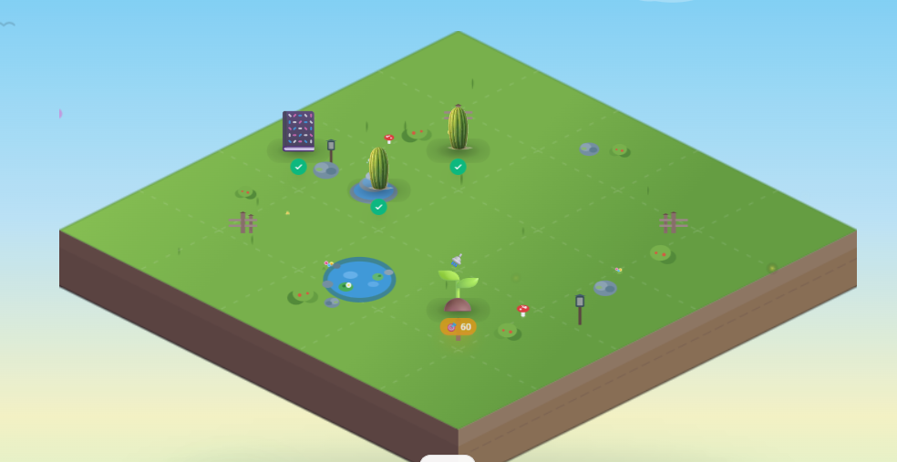
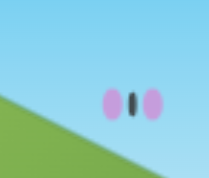
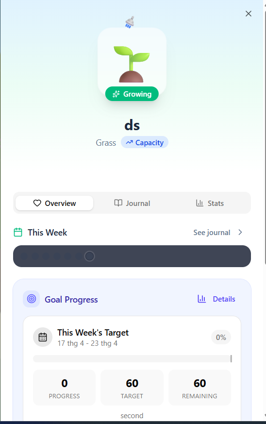

# Goal phải tự động làm tròn và phải tạo biểu đồ để người xem hào hứng với kế hoạch của mình.

Ngoài ra còn có cơ chế để hiểu hơn về cách tính và thống kê min/max của mỗi ngày/tuần/tháng. Tránh tình trạng người dùng không hiểu tại sao mình log rồi mà con số thực hiện không đổi giống như là không ghi nhận nhưng thật ra là do họ tính theo max nên con số thực hiện phải hơn max mới thay đổi.

# Khu vườn còn cơ chế mở rộng đất khi di chuyển cây dù level thấp. Cần xem xét lại để coi có nên giữ lại cơ chế này để người dùng phấn khích lúc đầu không.

# Trang trí quá xấu và chồng lấn lên các ô của cây. nó có thể random nhưng không đè lên cây hoặc không ở chính giữa ô của cây.

# Animation bướm là 2 vòng tròn xoay cùng chiều, trang trí quá đơn giản

<!--
# Phần sheet này cần phải thiết kế lại vì không mang lại signal gì, toàn là noise

 -->
