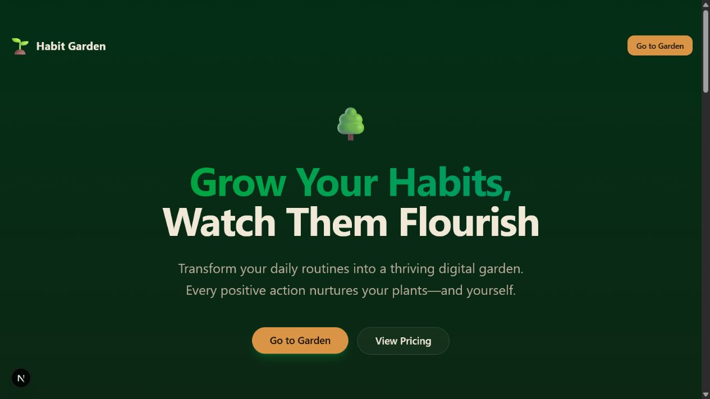
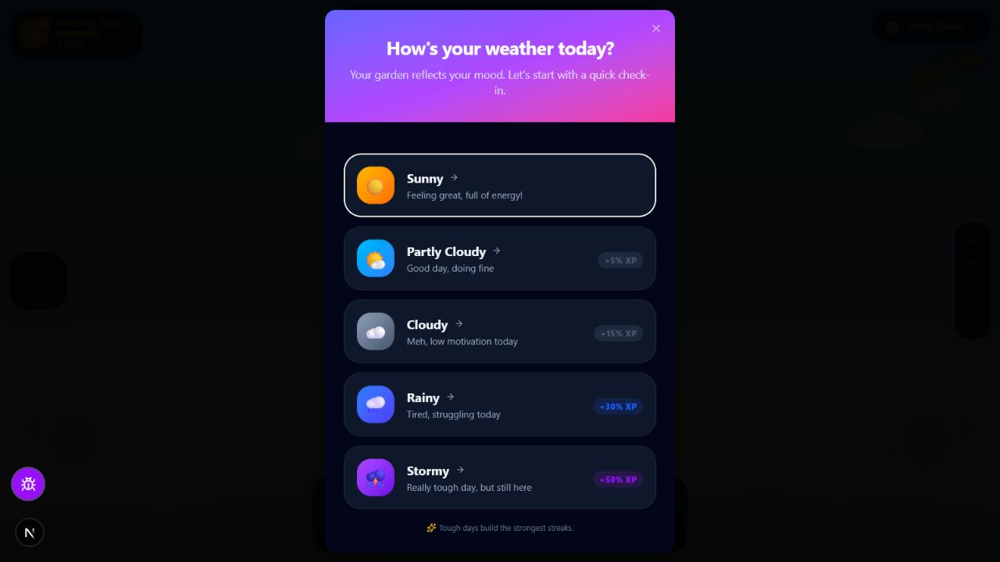
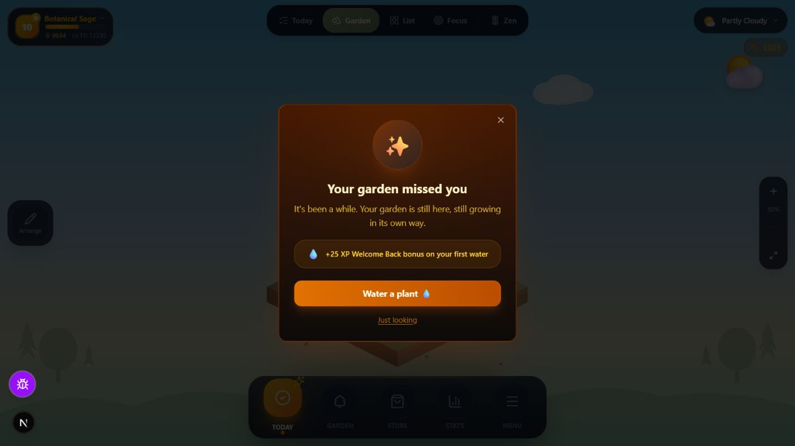
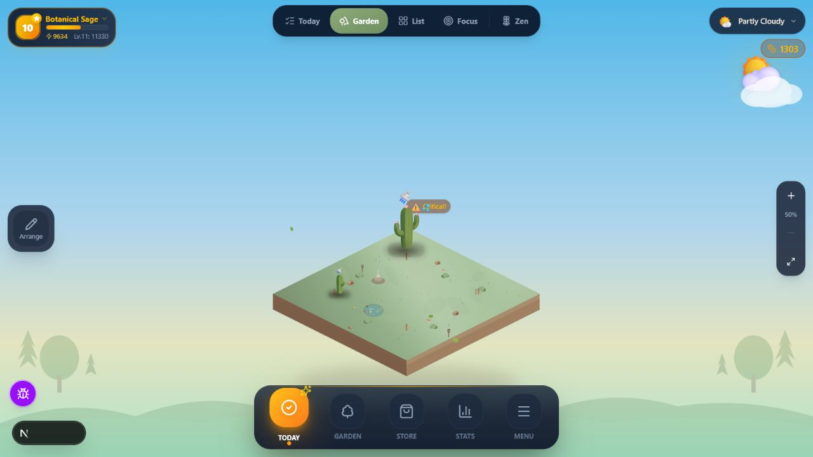
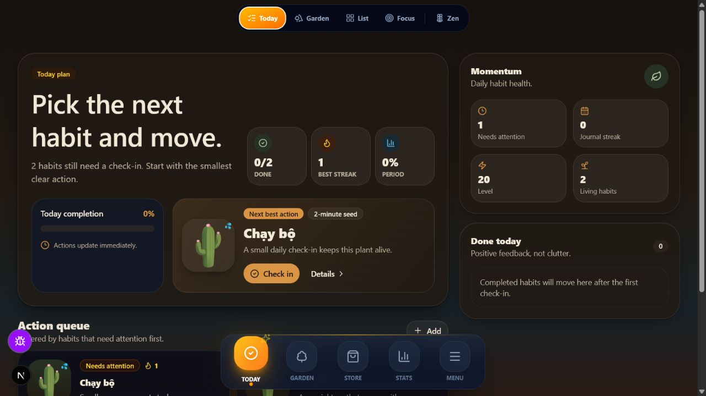

# Habit Garden — Phân tích ngõ cụt UI/UX và chiến lược retention

Ngày đánh giá: 2026-07-10

## Kết luận ngắn

Habit Garden không thiếu tính năng và cũng chưa cần thêm một “cốt truyện lớn”. Vấn đề chính là **Reward Separation** — hành động check-in và phần thưởng cảm xúc của khu vườn đang nằm ở hai bề mặt khác nhau. Màn Today tối ưu việc hoàn thành, còn Garden giữ phần hình ảnh; vì vậy trải nghiệm hằng ngày vẫn có cảm giác dùng dashboard habit tracker thay vì chăm một thế giới sống.

Hướng đề xuất là **Garden-First Daily Loop**: mở app là vào khu vườn, thấy đúng một cây cần mình, thực hiện một hành động trong vài giây, và nhìn cây cùng khu vườn phản hồi ngay tại chỗ. Stats, XP, Store và Goal vẫn tồn tại nhưng trở thành lớp sâu hơn, không cạnh tranh với nhịp hằng ngày.

## Phạm vi và bằng chứng

- Tài liệu nguồn: root README, OpenWiki `garden-ui.md` và `domain-model.md`, expert brief ngày 2026-07-09, Unified Vision Plan, design concept, gamification spec và code hiện tại.
- Flow đã quan sát trực tiếp trên app local: landing → vào garden → mood/return state → Garden mode → Today mode.
- Không thực hiện check-in thật để tránh thay đổi dữ liệu của tài khoản. Do đó phản hồi sau check-in được đánh giá thêm từ code celebration/watering hiện tại, không phải bằng screenshot live.

## Flow đã kiểm tra

### 1. Landing — sức khỏe: Trung bình

Thông điệp “grow your habits” rõ và CTA dễ thấy, nhưng hero chưa cho thấy sản phẩm thật hoặc sự biến đổi của cây. Người mới được nghe lời hứa nhưng chưa nhìn thấy khoảnh khắc gây thích thú. Visual hiện giống landing SaaS cao cấp hơn là cửa vào một thế giới game.

### 2. Mood check-in / return entry — sức khỏe: Yếu

Mood Check-In xuất hiện cùng lúc với Welcome Back trong DOM, tạo hai dialog cạnh tranh focus và thứ tự ưu tiên. Mood đáng ra là một lựa chọn nhẹ hoặc được suy ra sau hành động; hiện nó trở thành cổng chặn trước khi người dùng chạm vào cây. Màu tím/hồng và dark HUD cũng tách khỏi ngôn ngữ “Living Garden”.

Rủi ro accessibility: hai dialog đồng thời làm reading order và focus trap khó đoán; chữ phụ và XP bonus có độ tương phản thấp trên nền tối; cần test keyboard và screen reader thật.

### 3. Welcome Back — sức khỏe: Khá, nhưng sai trọng tâm

Copy “your garden is still here” phù hợp triết lý no-guilt. Tuy nhiên phần thưởng `+25 XP` và CTA màu cam chiếm trọng tâm hơn sự đoàn tụ với cây. Màn này nên cho thấy cây hoặc thay đổi trong khu vườn, sau đó mới ghi nhận XP ở lớp phụ.

### 4. Garden mode — sức khỏe: Trung bình

Garden có tiềm năng là “phần thưởng thị giác” nhưng cây nhỏ, khoảng trống lớn và HUD chiếm nhiều attention. Nhãn `Critical!` mâu thuẫn trực tiếp với Gentle Growth. Hai cấp navigation cùng dùng Today/Garden nhưng không đồng nhất: bottom nav đang ở Today trong khi mode toolbar đang ở Garden.

Rủi ro accessibility: trạng thái cây dựa nhiều vào nhãn nhỏ/màu; control zoom và HUD có thể nhỏ trên mobile; cần kiểm tra target size, zoom/reflow và alternative text trong canvas.

### 5. Today mode — sức khỏe: Yếu đối với retention cảm xúc

Màn hình rõ về mặt vận hành, nhưng chứa nhiều lớp số liệu trước hành động: completion, best streak, period, momentum, level, living habits, action queue và done today. Đây là **Dashboard Gravity** — UI kéo sản phẩm quay lại mô hình productivity dashboard dù design guideline đã nói ngược lại. Cây chỉ là thumbnail trong card, nên check-in không tạo cảm giác đang tác động vào khu vườn.

## Chẩn đoán gốc

1. **Reward Separation** — hành động nằm ở Today, phần thưởng nằm ở Garden. Người dùng phải tự nối hai khoảnh khắc mà core loop đáng ra phải nối hộ.
2. **Narrative Flatness** — cây chủ yếu kể chuyện bằng phần trăm, status, XP và streak. Có tiến trình nhưng thiếu “chuyện gì vừa xảy ra với cây của tôi?”.
3. **Motivational Tone Conflict** — “no guilt”, “resting is part of growing” cùng tồn tại với `Critical!`, “keeps this plant alive”, wither và “strongest streaks”.
4. **Hierarchy Overload** — mood, weather, moisture, growth, goal, streak, XP, level, coin, material và crafting đều muốn xuất hiện trong daily loop.
5. **Visual World Fragmentation** — landing xanh trầm, mood tím neon, Welcome Back cam tối, Garden pastel và Today nâu dashboard tạo cảm giác nhiều sản phẩm ghép lại.

## Định vị trải nghiệm mới

**Ambient Narrative** là cốt truyện được kể bằng thay đổi nhỏ của thế giới, thay vì một tuyến truyện dài phải đọc. Chọn Ambient Narrative vì nó giải quyết **Daily Return Curiosity**, trong khi lore tuyến tính chỉ giải quyết **Content Depth** và nhanh trở thành gánh nặng sản xuất.

Lời hứa sản phẩm đề xuất:

> Mỗi ngày chăm một khoảnh vườn. Mỗi mùa viết một chương về con người bạn đang trở thành.

Vai trò người dùng là **Garden Keeper**; mỗi habit là một sinh vật sống gắn với “Why I started”; mỗi tuần là một đoạn nhịp; mỗi season là một chapter; cây lâu năm là bằng chứng về identity theo năm tháng.

## Core loop đề xuất

1. **Arrive** — khu vườn mở ngay, thời tiết và âm thanh phản ánh ngày hôm nay nhưng không chặn bằng modal.
2. **Notice** — đúng một cây khẽ gọi attention bằng animation mềm và một câu ngắn: “Chạy bộ đang chờ một bước nhỏ”.
3. **Act** — ba lựa chọn nhất quán: `Tôi đã làm`, `2 phút cũng được`, `Hôm nay nghỉ`.
4. **React** — ngay trên garden: nước chạm đất, cây đổi pose/ánh sáng, xuất hiện một chi tiết mới và haptic/sound ngắn; XP chỉ là ghi chú phụ.
5. **Reveal** — một micro-event có xác suất: giọt sương, chim ghé, nụ hoa, ký ức cũ, vật liệu hoặc câu phản hồi của cây.
6. **Anticipate** — đóng loop bằng một teaser có nghĩa: “Còn 2 lần chăm nữa để chồi non mở” hoặc “Chủ nhật cây sẽ kể lại tuần này”.

## Cốt truyện nên xây như thế nào

### Daily: “Proof of life”

Mỗi check-in phải tạo một khác biệt có thể nhìn thấy dù growth stage chưa đổi: leaf pose, dew, flower bud, soil detail, visitor, weather interaction hoặc một dòng nhật ký trên cây. Đây là lớp tăng trưởng ngắn hạn.

### Weekly: “Garden letter”

Cuối tuần, một cây viết 2–3 câu dựa trên dữ liệu thật: ngày nào dễ, ngày nào nghỉ, điều gì user ghi chú. Không chấm điểm; chỉ phản chiếu pattern và mở một visual nhỏ.

### Seasonal: “Chapter”

Mỗi goal/review cycle trở thành một mùa. Kết thúc mùa, người dùng chọn tên chapter, giữ một kỷ vật và quyết định tiếp tục, đổi nhịp hoặc để cây nghỉ. Đây là nơi Goal Progress có ý nghĩa, thay vì chen vào daily screen.

### Long-term: “Legacy tree”

Giữ quyết định **Dual Growth Model** đã có: short-cycle plants cho feedback nhanh và một long-cycle tree lớn qua nhiều năm. Chọn Dual Growth vì nó giải quyết đồng thời **Delayed Gratification Gap** và **Long-Term Identity Evidence**.

## Cấu trúc UI đề xuất

- Gộp Today + Garden thành một home duy nhất: garden chiếm 70–80% viewport; một `Next plant` card nổi phía dưới.
- Sau check-in, camera/viewport đưa người dùng thẳng đến phản ứng của cây; không chuyển qua dashboard hay toast che cảnh.
- Chỉ giữ một primary metric trên home: `hôm nay đã chăm x/y cây`. Moisture, growth, goal và streak đi vào Plant Detail theo progressive disclosure.
- Bottom nav giai đoạn đầu chỉ cần `Garden`, `Journey`, `Me`; Store mở từ garden object hoặc sau khi unlock. Stats nằm trong Journey.
- Mood trở thành một chip tùy chọn sau check-in hoặc một câu hỏi cuối ngày; Welcome Back và Mood không bao giờ cùng mở.
- Thay `Critical!` bằng trạng thái không khẩn cấp: `Thirsty`, `Quiet`, `Resting` hoặc chỉ dùng visual cue.
- Đưa “Why I started” và tiny seed lên trước số liệu trong Plant Detail.

## Lộ trình ưu tiên

### P0 — 1 đến 2 tuần: sửa core loop, chưa thêm feature

- Xây modal orchestrator: chỉ một entry modal có thể mở; ưu tiên Welcome Back, mood là optional.
- Đặt Garden làm home mặc định và gắn một `Next action` card trực tiếp trên garden.
- Sau check-in luôn trả về đúng cây và chạy một phản ứng thị giác tại chỗ.
- Bỏ `Critical!`, “keeps alive”, wither/death copy và XP khỏi vị trí primary.
- Giảm home còn một metric hành động; chuyển Momentum/Period/Level vào lớp sâu hơn.

### P1 — 2 đến 4 tuần: tạo lý do quay lại ngày mai

- Thêm 5–8 micro-state thay đổi hằng ngày cho cây/khoảnh vườn.
- Thiết kế post-check-in reveal theo variable pool nhưng không dùng loot-box pressure.
- Thêm teaser tiến trình gần nhất theo hình ảnh, không chỉ phần trăm.
- Chuẩn hóa Living Garden tokens cho landing, mood, return modal, garden và sheets.

### P2 — 4 đến 8 tuần: cốt truyện dữ liệu thật

- Weekly Garden Letter và reflection ngắn.
- Seasons/chapters cho goals; kỷ vật đặt được trong garden.
- Triển khai short-cycle garden + legacy tree theo Dual Growth Model.
- Chỉ sau khi loop này tốt mới mở rộng Store/crafting và economy.

## Thước đo kiểm chứng

- **Time to First Delight**: từ mở app đến phản ứng thị giác đầu tiên, mục tiêu dưới 20 giây.
- **Daily Loop Completion**: phần trăm session có ít nhất một `done / tiny / rest`.
- **Return After Miss**: tỷ lệ quay lại và check-in sau 3–7 ngày vắng.
- **D1/D7 retention** theo cohort mới.
- Tỷ lệ người dùng tự mở Garden lại sau check-in; nếu loop gộp tốt, hành vi này không còn cần thiết.
- Phỏng vấn 5 người với câu hỏi: “Bạn nhớ điều gì đã xảy ra với cây hôm qua?”; nếu câu trả lời chỉ là XP/streak, narrative chưa hoạt động.

## Không nên làm lúc này

- Không thêm currency, quest, shop item hoặc achievement trước khi daily reaction đủ vui.
- Không viết một lore dài với NPC và chapter scripted; chi phí content cao nhưng không sửa Reward Separation.
- Không redesign mọi screen cùng lúc; cần test một vertical slice: mở app → chăm một cây → phản ứng → teaser ngày mai.
- Không dùng streak làm lý do chính để quay lại; streak giải quyết loss aversion, không giải quyết attachment.

## Giới hạn đánh giá

- Screenshot chỉ xác nhận hierarchy, visual consistency và một phần accessibility; chưa thể kết luận WCAG compliance.
- Chưa kiểm tra full mobile flow, screen reader, keyboard focus sau animation, network errors hoặc trạng thái empty/new user.
- Không gửi check-in thật nên chưa có screenshot live của celebration; code hiện cho thấy celebration ưu tiên card `Watered + XP`, cần đổi trọng tâm sang biến đổi của chính cây và khu vườn.
