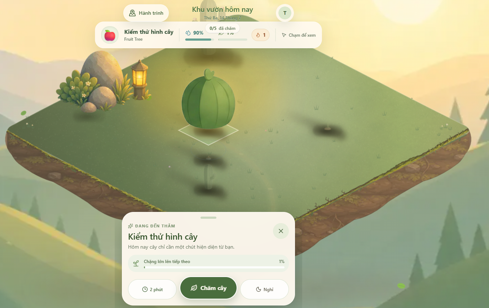

Thêm vật trang trí: thay vì là 1 nút trên màn hình thì chúng ta tạo nó thành 1 object trên garden tile. Nhấn vào object đó để kích hoạt edit mode. Object đó có thể là một người giữ vườn, một linh vật,...

Khi hover vào cây lúc focus thì nó đã to càng to thêm

Badge thông tin nhanh khi hover nằm ở vị trí chồng lấn với các vùng thông tin khác

Khi focus cần cho cảm giác như plant card với cây đang focus

- Các offset dimention x,y cho từng plant

- có khả năng cho khách hàng tạo ảnh và theme, việc set offset giúp họ 